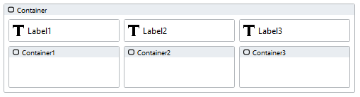
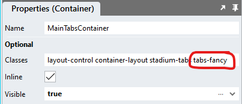

# Tabs

Displaying controls in tabs

https://github.com/stadium-software/tabs/assets/2085324/5e37ae8d-5013-44b8-8e6f-523744648eb5

## Sample applications
This repo contains one Stadium 6.6 application
[Tabs.sapz](Stadium6/Tabs.sapz?raw=true)

## Version
1.0

## Application Setup
1. Check the *Enable Style Sheet* checkbox in the application properties

## Global Script Setup
1. Create a Global Script and name it "Tabs"
2. Drag a Javascript action into the script and paste the Javascript below unaltered into the action
```javascript
/* Stadium Script Version 1.0 */
initTabs();

function initTabs() {
    let tabContainers = document.querySelectorAll(".stadium-tabs");
    for (let i = 0; i < tabContainers.length; i++) {
        let labelContainer = tabContainers[i].querySelector(".stack-layout-container:nth-child(1)");
        labelContainer.classList.add("tab-label-container");
        let contentContainer = tabContainers[i].querySelector(".stack-layout-container:nth-child(2)");
        contentContainer.classList.add("tab-content-container");
        let tabContent = tabContainers[i].querySelectorAll(".stack-layout-container:has(> .container-layout)")[0].children;
        tabContent[0].classList.add("active");
        for (let j = 0; j < tabContent.length; j++) {
            tabContent[j].classList.add("tabcontent");
            tabContent[j].setAttribute("tabindex", j);
        }
        let tabLabel = tabContainers[i].querySelectorAll(".stack-layout-container:has(> .label-container)")[0].children;
        tabLabel[0].classList.add("active");
        for (let j = 0; j < tabLabel.length; j++) {
            tabLabel[j].classList.add("tablabel");
            tabLabel[j].setAttribute("tabindex", j);
            tabLabel[j].addEventListener("click", activateTab);
        }
        slideBorder(labelContainer, tabLabel[0], tabLabel[0]);
    }
}
function slideBorder(tabsC, el, active) {
    let speed = getComputedStyle(el.closest(".stadium-tabs")).getPropertyValue("--stadium-tab-bottom-border-animation-speed").replace("s", "");
    if (!speed) {
        speed = getComputedStyle(document.documentElement).getPropertyValue("--stadium-tab-bottom-border-animation-speed").replace("s", "");
    }
    if (speed) {
        if (speed > 0) {
            let elWd = el.offsetWidth / tabsC.offsetWidth;
            let tWidth;
            if (el.getAttribute("tabindex") < active.getAttribute("tabindex")) {
                tWidth = el.offsetLeft + el.offsetWidth - active.offsetLeft;
            } else {
                tWidth = active.offsetLeft + active.offsetWidth - el.offsetLeft;
                tabsC.style.setProperty("--_left", el.offsetLeft + "px");
            }
            tabsC.style.setProperty("--_width", tWidth / tabsC.offsetWidth);
            setTimeout(() => {
                tabsC.style.setProperty("--_left", el.offsetLeft + "px");
                tabsC.style.setProperty("--_width", elWd);
            }, speed * 100);
        }
    }
}
function activateTab(e) {
    let clickedEl = e.target;
    let labelContainer = clickedEl.closest(".stadium-tabs").querySelector(".stack-layout-container:nth-child(1)");
    let tabs = clickedEl.closest(".stadium-tabs");
    let oldTabLabel = tabs.querySelector(".tablabel.active");
    let oldTabContent = tabs.querySelector(".tabcontent.active");
    let newTabLabel = clickedEl.closest(".tablabel");
    let newTabIndex = newTabLabel.getAttribute("tabindex");
    let newTabContent = tabs.querySelector(".tabcontent[tabindex='" + newTabIndex + "']");
    oldTabLabel.classList.remove("active");
    newTabLabel.classList.add("active");
    oldTabContent.classList.remove("active");
    newTabContent.classList.add("active");
    slideBorder(labelContainer, newTabLabel, oldTabLabel);
}
```

## Page Setup
1. Drag a *Container* control to a page. This will be the main tabs container
2. Assign a class called "stadium-tabs" to the *Container* control
3. Drag *Label* controls horizontally next to each other into the *Container* to create tabs
4. Use the *Label* *Text* property for the tab text
5. Drag *Container* controls horizontally next to each other under the Labels to create tab content areas
6. Drag controls you wish to show inside the tabs into the containers
7. NOTE: There must be an equal number of *Label* and *Container* controls as direct children inside the main tabs container



## Page.Load Setup
1. Drag the Global Script called "Tabs" into the Page.Load event handler

## Horizontal / Vertical Display
By default all tab controls are shown horizontally 

To display tabs vertically, add a class called "tabs-vertical" to the main tabs container control

# Styling
Various elements in this module can be styled using the two CSS files in this repo

## Applying the CSS

**Stadium 6.6 or higher**
1. Create a folder called "CSS" inside of your Embedded Files in your application
2. Drag the two CSS files from this repo [*tabs-variables.css*](tabs-variables.css) and [*tabs.css*](tabs.css) into that folder
3. Paste the link tags below into the *head* property of your application
```html
<link rel="stylesheet" href="{EmbeddedFiles}/CSS/tabs.css">
<link rel="stylesheet" href="{EmbeddedFiles}/CSS/tabs-variables.css">
``` 


**Versions lower than 6.6**
1. Copy the CSS from the two css files into the Stylesheet in your application

## Customising CSS
1. Open the CSS file called [*tabs-variables.css*](tabs-variables.css) from this repo
2. Adjust the variables in the *:root* element as you see fit
3. Overwrite the file in the CSS folder of your application with the customised file

## Implementing styling from an example
In order to use one of the custom examples provided in the example application

1. Open the CSS file called [*tabs-variables.css*](tabs-variables.css) from this repo
2. Copy the classname of the set of variables you wish to use (e.g. tabs-fancy)
3. Paste the class into the main tabs *Container* control



## CSS Upgrading
To upgrade the CSS in this module, follow the [steps outlined in this repo](https://github.com/stadium-software/samples-upgrading)

# Optional Custom Development
1. Allowing users to save searches to the database (save generated search phase)
2. Providing a dropdown for users to apply previously saved searches (populate search field with previously saved phrase)
