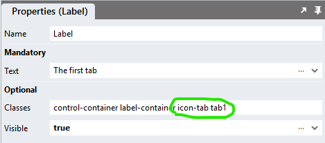

# Tabs <!-- omit in toc -->

Displaying controls in tabs. Use multi-page tabs to keep the number of controls a page low. 

https://github.com/stadium-software/tabs/assets/2085324/dc0c3b27-b805-4bab-97be-a19b7ae7bfa7

## Contents <!-- omit in toc -->
- [Version](#version)
  - [Changes](#changes)
- [Setup](#setup)
  - [Application](#application)
  - [Global Script](#global-script)
  - [Page.Load](#pageload)
  - [Single-Page](#single-page)
  - [Multi-Page](#multi-page)
- [Tab Icons](#tab-icons)
  - [CSS](#css)
    - [Before v6.12](#before-v612)
    - [v6.12+](#v612)
    - [Customising CSS](#customising-css)
  - [Upgrading Stadium Repos](#upgrading-stadium-repos)

# Version
1.3.1

## Changes
1.1 Added support for multi-page tabs

1.2 Added setting selected tab programatically (update JS)

1.2.1 Fixed 'no-scrollbar bug' for wide tabs (tabs.css only)

1.3 Added 
1. A gap variable for defining the width of the gap to be shown between tabs (default is 0) (both CSS files)
2. A variable for the content tab background color  (both CSS files)

1.3.1 Changed px to rem; Updated readme for 6.12+; Removed fancy tabs, vertical tabs, iconify library; added css for icon tabs to sample

# Setup

## Application 
1. Check the *Enable Style Sheet* checkbox in the application properties

## Global Script 
1. Create a Global Script and name it "Tabs"
2. Add an input parameter to the Global Script
   1. SelectedTab
3. Drag a Javascript action into the script and paste the Javascript below into the action
4. Do not make any changes to any of this script
```javascript
/* Stadium Script Version 1.3 https://github.com/stadium-software/tabs */
let selectedTab = ~.Parameters.Input.SelectedTab;
if (!isNumber(selectedTab)) {
    selectedTab = 1;
}
initTabs();
function initTabs() {
    let tabContainers = document.querySelectorAll(".stadium-tabs");
    for (let i = 0; i < tabContainers.length; i++) {
        if (tabContainers[i].querySelector('.tab-label-container')) {
            setActiveTab(tabContainers[i], selectedTab);
            continue;
        }
        let labelContainer = tabContainers[i].querySelector(".stack-layout-container:nth-child(1)");
        labelContainer.classList.add("tab-label-container");
        let contentContainer = tabContainers[i].querySelector(".stack-layout-container:nth-child(2)");
        contentContainer.classList.add("tab-content-container");
        let tabLabel = labelContainer.children;
        for (let j = 0; j < tabLabel.length; j++) {
            tabLabel[j].classList.add("tablabel");
            tabLabel[j].setAttribute("tabnumber", j + 1);
            tabLabel[j].addEventListener("click", selectTab);
        }
        let tabContent = contentContainer.children;
        for (let j = 0; j < tabContent.length; j++) {
            tabContent[j].classList.add("tabcontent");
            tabContent[j].setAttribute("tabnumber", j + 1);
        }
        if (tabContainers[i].querySelector(".active-tab")) {
            selectedTab = tabContainers[i].querySelector(".active-tab").getAttribute("tabnumber");
        }
        setActiveTab(tabContainers[i], selectedTab);
        tabContainers[i].style.visibility = "visible";
    }
}
function setActiveTab(tabsContainer, tabNo) {
    let prevSelectedLbl;
    let activeEls = tabsContainer.querySelectorAll(".active-tab");
    for (let i=0; i < activeEls.length; i++){
        activeEls[i].classList.remove("active-tab");
        if (activeEls[i].classList.contains("tablabel")) {
            prevSelectedLbl = activeEls[i];
        }
    }
    let tabcontent = tabsContainer.querySelector(".tab-content-container .tabcontent:nth-child(" + tabNo + ")");
    let tablabel = tabsContainer.querySelector(".tab-label-container .tablabel:nth-child(" + tabNo + ")");
    tabcontent.classList.add("active-tab");
    tablabel.classList.add("active-tab");
    if (tabsContainer.classList.contains("tabs-fancy")) slideBorder(tablabel.closest(".tab-label-container"), tablabel, prevSelectedLbl || tabsContainer.querySelectorAll(".tablabel")[0]);
}
function selectTab(e) {
    let clickedEl = e.target;
    let link = clickedEl.querySelector("a");
    if (link) {
        link.click();
    } else {
        let tabs = clickedEl.closest(".stadium-tabs");
        let newTabLabel = clickedEl.closest(".tablabel");
        let newtabnumber = newTabLabel.getAttribute("tabnumber");
        setActiveTab(tabs, newtabnumber);
    }
}
function isNumber(str) {
    if (typeof str == "number") return true;
    return !isNaN(str) && !isNaN(parseFloat(str));
}
function slideBorder(tabsC, el, active) {
    let speed = getComputedStyle(el.closest(".stadium-tabs")).getPropertyValue("--stadium-tab-bottom-border-animation-speed").replace("s", "");
    if (!speed) {
        speed = getComputedStyle(document.documentElement).getPropertyValue("--stadium-tab-bottom-border-animation-speed").replace("s", "");
    }
    if (speed) {
        if (speed > 0) {
            let elWd = el.offsetWidth / tabsC.offsetWidth;
            let tWidth;
            if (el.getAttribute("tabnumber") < active.getAttribute("tabnumber")) {
                tWidth = el.offsetLeft + el.offsetWidth - active.offsetLeft;
            } else {
                tWidth = active.offsetLeft + active.offsetWidth - el.offsetLeft;
                tabsC.style.setProperty("--_left", el.offsetLeft + "px");
            }
            tabsC.style.setProperty("--_width", tWidth / tabsC.offsetWidth);
            setTimeout(() => {
                tabsC.style.setProperty("--_left", el.offsetLeft + "px");
                tabsC.style.setProperty("--_width", elWd);
            }, speed * 100);
        }
    }
}
```

## Page.Load 
1. Drag the Global Script called "Tabs" into the Page.Load event handler of each page where tabs are to be shown
2. Optionally pass in the selected tab number (default is 1)

## Single-Page 
1. Drag a *Container* control to a page. This will be the main tabs container
2. Assign a class called "stadium-tabs" to the *Container* control
3. Drag *Label* controls horizontally next to each other into the *Container* to create tabs
4. Use the *Label* *Text* property for the tab text
5. Drag *Container* controls horizontally next to each other under the Labels to create tab content areas
6. Drag controls you wish to show inside the tabs into the containers
7. NOTE: There must be an equal number of *Label* and *Container* controls as direct children inside the main tabs container


## Multi-Page 
In the multi-page setup, we will create the same set of tabs as in the single-page setup, but instead of *Label* controls for text, we will use *Link* controls. When users click on a tab, the link contained therein must navigate them to another page where we will show the same set of tabs. On each page where we show the tabs, we will indicate which tab should be the active one. 

1. Drag *Container* controls to each page where this set of tabs are to show
2. Assign a class called "stadium-tabs" to each *Container* control
3. Drag *Link* controls horizontally next to each other into the *Container* to create tabs
4. Use the *Link* *Text* property for the tab text and the *Destination* property to navigate between pages / tabs
5. Add a class called "active-tab" to one *Link* control on each page. The control with this class will become the active tab on the page. 
6. Drag *Container* controls horizontally next to each other under the Labels to create tab content areas
7. Drag controls you wish to show inside the tabs into the containers. You only ever need content for the active tab. All other tabs can remain empty. 
8. NOTE: As each page will only ever show one tab, the other tabs do not require any content and only need an empty content container


# Tab Icons
To display icons in tabs, add classes to the tabs and some CSS to amend the label display.

For example CSS below add the classes "icon-tab" and "tab1" (or tab2 or tab3) to the tab labels.



Example CSS
```css
/*Icon Tabs*/
.container-layout.stadium-tabs .icon-tab {
    /*for all icon tabs*/
	padding-left: 50px;
	line-height: 30px;
    background-repeat: no-repeat;
    background-size: 26px;
    background-position: left 16px center;
}
/*for the first tab*/
.tab1 {
    background-image: url("data:image/svg+xml,%3Csvg xmlns='http://www.w3.org/2000/svg' width='1em' height='1em' viewBox='0 0 24 24'%3E%3C!-- Icon from Material Symbols by Google - https://github.com/google/material-design-icons/blob/master/LICENSE --%3E%3Cpath fill='%23ffffff' d='M5 21q-.825 0-1.412-.587T3 19V5q0-.825.588-1.412T5 3h6.525q.5 0 .75.313t.25.687t-.262.688T11.5 5H5v14h14v-6.525q0-.5.313-.75t.687-.25t.688.25t.312.75V19q0 .825-.587 1.413T19 21zm4-7v-2.425q0-.4.15-.763t.425-.637l8.6-8.6q.3-.3.675-.45t.75-.15q.4 0 .763.15t.662.45L22.425 3q.275.3.425.663T23 4.4t-.137.738t-.438.662l-8.6 8.6q-.275.275-.637.438t-.763.162H10q-.425 0-.712-.288T9 14m12.025-9.6l-1.4-1.4zM11 13h1.4l5.8-5.8l-.7-.7l-.725-.7L11 11.575zm6.5-6.5l-.725-.7zl.7.7z'/%3E%3C/svg%3E");
}
.tab1.active-tab {
    background-image: url("data:image/svg+xml,%3Csvg xmlns='http://www.w3.org/2000/svg' width='1em' height='1em' viewBox='0 0 24 24'%3E%3C!-- Icon from Material Symbols by Google - https://github.com/google/material-design-icons/blob/master/LICENSE --%3E%3Cpath fill='%233c3c3c' d='M5 21q-.825 0-1.412-.587T3 19V5q0-.825.588-1.412T5 3h6.525q.5 0 .75.313t.25.687t-.262.688T11.5 5H5v14h14v-6.525q0-.5.313-.75t.687-.25t.688.25t.312.75V19q0 .825-.587 1.413T19 21zm4-7v-2.425q0-.4.15-.763t.425-.637l8.6-8.6q.3-.3.675-.45t.75-.15q.4 0 .763.15t.662.45L22.425 3q.275.3.425.663T23 4.4t-.137.738t-.438.662l-8.6 8.6q-.275.275-.637.438t-.763.162H10q-.425 0-.712-.288T9 14m12.025-9.6l-1.4-1.4zM11 13h1.4l5.8-5.8l-.7-.7l-.725-.7L11 11.575zm6.5-6.5l-.725-.7zl.7.7z'/%3E%3C/svg%3E");
}
/*for the second tab*/
.tab2 {
    background-image: url("data:image/svg+xml,%3Csvg xmlns='http://www.w3.org/2000/svg' width='1em' height='1em' viewBox='0 0 24 24'%3E%3C!-- Icon from Material Symbols by Google - https://github.com/google/material-design-icons/blob/master/LICENSE --%3E%3Cpath fill='%23ffffff' d='M10 8q-.425 0-.712-.288T9 7t.288-.712T10 6h4q.425 0 .713.288T15 7t-.288.713T14 8zM7 22q-.825 0-1.412-.587T5 20t.588-1.412T7 18t1.413.588T9 20t-.587 1.413T7 22m10 0q-.825 0-1.412-.587T15 20t.588-1.412T17 18t1.413.588T19 20t-.587 1.413T17 22M3 4H2q-.425 0-.712-.288T1 3t.288-.712T2 2h1.65q.275 0 .525.15t.375.425L8.525 11h7l3.625-6.5q.125-.25.35-.375T20 4q.575 0 .863.488t.012.987L17.3 11.95q-.275.5-.737.775T15.55 13H8.1L7 15h11q.425 0 .713.288T19 16t-.288.713T18 17H7q-1.125 0-1.713-.975T5.25 14.05L6.6 11.6z'/%3E%3C/svg%3E");
}
.tab2.active-tab {
    background-image: url("data:image/svg+xml,%3Csvg xmlns='http://www.w3.org/2000/svg' width='1em' height='1em' viewBox='0 0 24 24'%3E%3C!-- Icon from Material Symbols by Google - https://github.com/google/material-design-icons/blob/master/LICENSE --%3E%3Cpath fill='%233c3c3c' d='M10 8q-.425 0-.712-.288T9 7t.288-.712T10 6h4q.425 0 .713.288T15 7t-.288.713T14 8zM7 22q-.825 0-1.412-.587T5 20t.588-1.412T7 18t1.413.588T9 20t-.587 1.413T7 22m10 0q-.825 0-1.412-.587T15 20t.588-1.412T17 18t1.413.588T19 20t-.587 1.413T17 22M3 4H2q-.425 0-.712-.288T1 3t.288-.712T2 2h1.65q.275 0 .525.15t.375.425L8.525 11h7l3.625-6.5q.125-.25.35-.375T20 4q.575 0 .863.488t.012.987L17.3 11.95q-.275.5-.737.775T15.55 13H8.1L7 15h11q.425 0 .713.288T19 16t-.288.713T18 17H7q-1.125 0-1.713-.975T5.25 14.05L6.6 11.6z'/%3E%3C/svg%3E");
}
/*for the third tab*/
.tab3 {
    background-image: url("data:image/svg+xml,%3Csvg xmlns='http://www.w3.org/2000/svg' width='1em' height='1em' viewBox='0 0 24 24'%3E%3C!-- Icon from Material Symbols by Google - https://github.com/google/material-design-icons/blob/master/LICENSE --%3E%3Cpath fill='%23ffffff' d='M19.425 18H16.25q-.425 0-.712-.288T15.25 17t.288-.712t.712-.288h3.175l-.9-.9q-.275-.275-.275-.687t.3-.713q.275-.275.7-.275t.7.275l2.6 2.6q.3.3.3.7t-.3.7l-2.6 2.6q-.275.275-.687.288t-.713-.288q-.275-.275-.275-.7t.275-.7zM10 10q.825 0 1.413-.587T12 8t-.587-1.412T10 6t-1.412.588T8 8t.588 1.413T10 10m-8 .2q0-3.75 2.413-5.975T10 2q1.8 0 3.238.625t2.475 1.725t1.612 2.588t.65 3.212q.025.425-.262.713T17 11.15t-.712-.288t-.313-.712q-.125-2.525-1.812-4.337T10 4Q7.475 4 5.738 5.738T4 10.2q0 1.775 1.475 4.063T10 19.35q.35-.3.663-.6t.587-.6q.3-.3.713-.3t.712.275t.313.687t-.288.713q-.4.425-.762.763t-.613.537q-.275.25-.625.375t-.7.125t-.7-.125t-.625-.375q-1-.925-2.175-2.15t-2.175-2.612t-1.662-2.888T2 10.2m8 4.8q1.05 0 1.988-.425t1.662-1.2q.125-.125.175-.288t.05-.337q0-.275-.112-.513t-.363-.362q-.775-.45-1.638-.663T10 11t-1.763.213t-1.637.662q-.225.125-.35.35t-.125.5q0 .2.05.363t.175.287q.725.775 1.663 1.2T10 15'/%3E%3C/svg%3E");
}
.tab3.active-tab {
    background-image: url("data:image/svg+xml,%3Csvg xmlns='http://www.w3.org/2000/svg' width='1em' height='1em' viewBox='0 0 24 24'%3E%3C!-- Icon from Material Symbols by Google - https://github.com/google/material-design-icons/blob/master/LICENSE --%3E%3Cpath fill='%233c3c3c' d='M19.425 18H16.25q-.425 0-.712-.288T15.25 17t.288-.712t.712-.288h3.175l-.9-.9q-.275-.275-.275-.687t.3-.713q.275-.275.7-.275t.7.275l2.6 2.6q.3.3.3.7t-.3.7l-2.6 2.6q-.275.275-.687.288t-.713-.288q-.275-.275-.275-.7t.275-.7zM10 10q.825 0 1.413-.587T12 8t-.587-1.412T10 6t-1.412.588T8 8t.588 1.413T10 10m-8 .2q0-3.75 2.413-5.975T10 2q1.8 0 3.238.625t2.475 1.725t1.612 2.588t.65 3.212q.025.425-.262.713T17 11.15t-.712-.288t-.313-.712q-.125-2.525-1.812-4.337T10 4Q7.475 4 5.738 5.738T4 10.2q0 1.775 1.475 4.063T10 19.35q.35-.3.663-.6t.587-.6q.3-.3.713-.3t.712.275t.313.687t-.288.713q-.4.425-.762.763t-.613.537q-.275.25-.625.375t-.7.125t-.7-.125t-.625-.375q-1-.925-2.175-2.15t-2.175-2.612t-1.662-2.888T2 10.2m8 4.8q1.05 0 1.988-.425t1.662-1.2q.125-.125.175-.288t.05-.337q0-.275-.112-.513t-.363-.362q-.775-.45-1.638-.663T10 11t-1.763.213t-1.637.662q-.225.125-.35.35t-.125.5q0 .2.05.363t.175.287q.725.775 1.663 1.2T10 15'/%3E%3C/svg%3E");
}
```

## CSS
The CSS below is required for the correct functioning of the module. Variables exposed in the [*tabs-variables.css*](tabs-variables.css) file can be [customised](#customising-css).

### Before v6.12
1. Create a folder called "CSS" inside of your Embedded Files in your application
2. Drag the two CSS files from this repo [*tabs-variables.css*](tabs-variables.css) and [*tabs.css*](tabs.css) into that folder
3. Paste the link tags below into the *head* property of your application
```html
<link rel="stylesheet" href="{EmbeddedFiles}/CSS/tabs.css">
<link rel="stylesheet" href="{EmbeddedFiles}/CSS/tabs-variables.css">
``` 

### v6.12+
1. Create a folder called "CSS" inside of your Embedded Files in your application
2. Drag the CSS files from this repo [*tabs.css*](tabs.css) into that folder
3. Paste the link tag below into the *head* property of your application
```html
<link rel="stylesheet" href="{EmbeddedFiles}/CSS/tabs.css">
``` 

### Customising CSS
1. Open the CSS file called [*tabs-variables.css*](tabs-variables.css) from this repo
2. Adjust the variables in the *:root* element as you see fit
3. Stadium 6.12+ users can comment out any variable they do **not** want to customise
4. Add the [*tabs-variables.css*](tabs-variables.css) to the "CSS" folder in the EmbeddedFiles (overwrite)
5. Paste the link tag below into the *head* property of your application (if you don't already have it there)
```html
<link rel="stylesheet" href="{EmbeddedFiles}/CSS/tabs-variables.css">
``` 
6. Add the file to the "CSS" inside of your Embedded Files in your application

**NOTE: Do not change any of the CSS in the 'tabs.css' file**

## Upgrading Stadium Repos
Stadium Repos are not static. They change as additional features are added and bugs are fixed. Using the right method to work with Stadium Repos allows for upgrading them in a controlled manner. 

How to use and update application repos is described here: [Working with Stadium Repos](https://github.com/stadium-software/samples-upgrading)