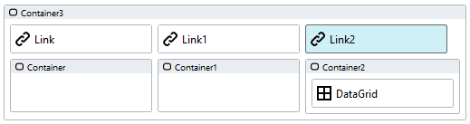
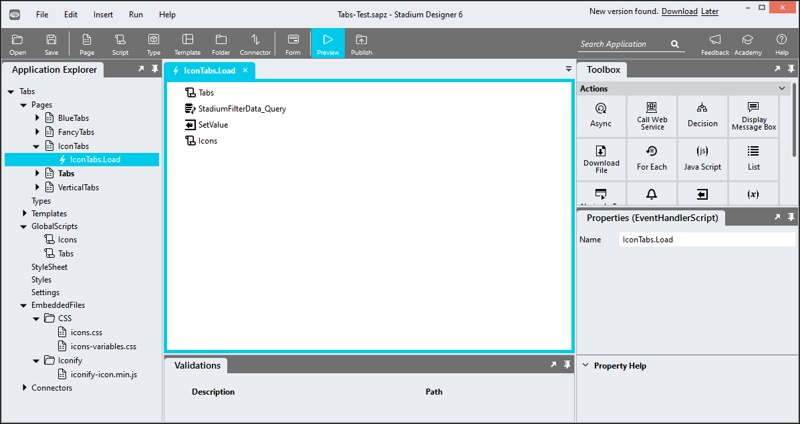

# Tabs <!-- omit in toc -->

Displaying controls in tabs. Use multi-page tabs to keep the number of controls a page low. 

https://github.com/stadium-software/tabs/assets/2085324/dc0c3b27-b805-4bab-97be-a19b7ae7bfa7

## Contents <!-- omit in toc -->
- [Version](#version)
  - [Changes](#changes)
- [Common Setup](#common-setup)
  - [Application Setup](#application-setup)
  - [Global Script Setup](#global-script-setup)
  - [Page.Load Setup](#pageload-setup)
  - [Single-Page Setup](#single-page-setup)
  - [Multi-Page Setup](#multi-page-setup)
- [Display Options](#display-options)
  - [Horizontal / Vertical Display](#horizontal--vertical-display)
  - [Tab Icons](#tab-icons)
  - [Icon Style Classes](#icon-style-classes)
  - [Applying the CSS](#applying-the-css)
  - [Customising CSS](#customising-css)
  - [Implementing styling from an example](#implementing-styling-from-an-example)
  - [CSS Upgrading](#css-upgrading)

# Version
1.3

## Changes
1.1 Added support for multi-page tabs

1.2 Added setting selected tab programatically (update JS)

1.2.1 Fixed 'no-scrollbar bug' for wide tabs (tabs.css only)

1.3 Added 
1. A gap variable for defining the width of the gap to be shown between tabs (default is 0) (both CSS files)
2. A variable for the content tab background color  (both CSS files)

# Common Setup

## Application Setup
1. Check the *Enable Style Sheet* checkbox in the application properties

## Global Script Setup
1. Create a Global Script and name it "Tabs"
2. Add an input parameter to the Global Script
   1. SelectedTab
3. Drag a Javascript action into the script and paste the Javascript below into the action
4. Do not make any changes to any of this script
```javascript
/* Stadium Script Version 1.3 https://github.com/stadium-software/tabs */
let selectedTab = ~.Parameters.Input.SelectedTab;
if (!isNumber(selectedTab)) {
    selectedTab = 1;
}
initTabs();
function initTabs() {
    let tabContainers = document.querySelectorAll(".stadium-tabs");
    for (let i = 0; i < tabContainers.length; i++) {
        if (tabContainers[i].querySelector('.tab-label-container')) {
            setActiveTab(tabContainers[i], selectedTab);
            continue;
        }
        let labelContainer = tabContainers[i].querySelector(".stack-layout-container:nth-child(1)");
        labelContainer.classList.add("tab-label-container");
        let contentContainer = tabContainers[i].querySelector(".stack-layout-container:nth-child(2)");
        contentContainer.classList.add("tab-content-container");
        let tabLabel = labelContainer.children;
        for (let j = 0; j < tabLabel.length; j++) {
            tabLabel[j].classList.add("tablabel");
            tabLabel[j].setAttribute("tabnumber", j + 1);
            tabLabel[j].addEventListener("click", selectTab);
        }
        let tabContent = contentContainer.children;
        for (let j = 0; j < tabContent.length; j++) {
            tabContent[j].classList.add("tabcontent");
            tabContent[j].setAttribute("tabnumber", j + 1);
        }
        if (tabContainers[i].querySelector(".active-tab")) {
            selectedTab = tabContainers[i].querySelector(".active-tab").getAttribute("tabnumber");
        }
        setActiveTab(tabContainers[i], selectedTab);
        tabContainers[i].style.visibility = "visible";
    }
}
function setActiveTab(tabsContainer, tabNo) {
    let prevSelectedLbl;
    let activeEls = tabsContainer.querySelectorAll(".active-tab");
    for (let i=0; i < activeEls.length; i++){
        activeEls[i].classList.remove("active-tab");
        if (activeEls[i].classList.contains("tablabel")) {
            prevSelectedLbl = activeEls[i];
        }
    }
    let tabcontent = tabsContainer.querySelector(".tab-content-container .tabcontent:nth-child(" + tabNo + ")");
    let tablabel = tabsContainer.querySelector(".tab-label-container .tablabel:nth-child(" + tabNo + ")");
    tabcontent.classList.add("active-tab");
    tablabel.classList.add("active-tab");
    if (tabsContainer.classList.contains("tabs-fancy")) slideBorder(tablabel.closest(".tab-label-container"), tablabel, prevSelectedLbl || tabsContainer.querySelectorAll(".tablabel")[0]);
}
function selectTab(e) {
    let clickedEl = e.target;
    let link = clickedEl.querySelector("a");
    if (link) {
        link.click();
    } else {
        let tabs = clickedEl.closest(".stadium-tabs");
        let newTabLabel = clickedEl.closest(".tablabel");
        let newtabnumber = newTabLabel.getAttribute("tabnumber");
        setActiveTab(tabs, newtabnumber);
    }
}
function isNumber(str) {
    if (typeof str == "number") return true;
    return !isNaN(str) && !isNaN(parseFloat(str));
}
function slideBorder(tabsC, el, active) {
    let speed = getComputedStyle(el.closest(".stadium-tabs")).getPropertyValue("--stadium-tab-bottom-border-animation-speed").replace("s", "");
    if (!speed) {
        speed = getComputedStyle(document.documentElement).getPropertyValue("--stadium-tab-bottom-border-animation-speed").replace("s", "");
    }
    if (speed) {
        if (speed > 0) {
            let elWd = el.offsetWidth / tabsC.offsetWidth;
            let tWidth;
            if (el.getAttribute("tabnumber") < active.getAttribute("tabnumber")) {
                tWidth = el.offsetLeft + el.offsetWidth - active.offsetLeft;
            } else {
                tWidth = active.offsetLeft + active.offsetWidth - el.offsetLeft;
                tabsC.style.setProperty("--_left", el.offsetLeft + "px");
            }
            tabsC.style.setProperty("--_width", tWidth / tabsC.offsetWidth);
            setTimeout(() => {
                tabsC.style.setProperty("--_left", el.offsetLeft + "px");
                tabsC.style.setProperty("--_width", elWd);
            }, speed * 100);
        }
    }
}
```

## Page.Load Setup
1. Drag the Global Script called "Tabs" into the Page.Load event handler of each page where tabs are to be shown
2. Optionally pass in the selected tab number (default is 1)

## Single-Page Setup
1. Drag a *Container* control to a page. This will be the main tabs container
2. Assign a class called "stadium-tabs" to the *Container* control
3. Drag *Label* controls horizontally next to each other into the *Container* to create tabs
4. Use the *Label* *Text* property for the tab text
5. Drag *Container* controls horizontally next to each other under the Labels to create tab content areas
6. Drag controls you wish to show inside the tabs into the containers
7. NOTE: There must be an equal number of *Label* and *Container* controls as direct children inside the main tabs container


## Multi-Page Setup
In the multi-page setup, we will create the same set of tabs as in the single-page setup, but instead of *Label* controls for text, we will use *Link* controls. When users click on a tab, the link contained therein must navigate them to another page where we will show the same set of tabs. On each page where we show the tabs, we will indicate which tab should be the active one. 

1. Drag *Container* controls to each page where this set of tabs are to show
2. Assign a class called "stadium-tabs" to each *Container* control
3. Drag *Link* controls horizontally next to each other into the *Container* to create tabs
4. Use the *Link* *Text* property for the tab text and the *Destination* property to navigate between pages / tabs
5. Add a class called "active-tab" to one *Link* control on each page. The control with this class will become the active tab on the page. 
6. Drag *Container* controls horizontally next to each other under the Labels to create tab content areas
7. Drag controls you wish to show inside the tabs into the containers. You only ever need content for the active tab. All other tabs can remain empty. 
8. NOTE: As each page will only ever show one tab, the other tabs do not require any content and only need an empty content container



# Display Options

## Horizontal / Vertical Display
By default all tab controls are shown horizontally 

To display tabs vertically, add a class called "tabs-vertical" to the main tabs container control

## Tab Icons
To display icons in tabs, the [Icons Module](https://github.com/stadium-software/icons) must be implemented in the application and the Icons script needs to be called in the Page.Load event handler. You can then apply classes to the tab label controls as described in the [Icons Module](https://github.com/stadium-software/icons) to display icons in your tabs. 



## Icon Style Classes

This repo supports the use of classes for the positioning, sizing and colouring of icons as described [here](https://github.com/stadium-software/icons?tab=readme-ov-file#icon-style-classes)

## Applying the CSS
The CSS below is required for the correct functioning of the module. Some elements can be [customised](#customising-css) using a variables CSS file. 

**Stadium 6.6 or higher**
1. Create a folder called "CSS" inside of your Embedded Files in your application
2. Drag the two CSS files from this repo [*tabs-variables.css*](tabs-variables.css) and [*tabs.css*](tabs.css) into that folder
3. Paste the link tags below into the *head* property of your application
```html
<link rel="stylesheet" href="{EmbeddedFiles}/CSS/tabs.css">
<link rel="stylesheet" href="{EmbeddedFiles}/CSS/tabs-variables.css">
``` 


**Versions lower than 6.6**
1. Copy the CSS from the two css files into the Stylesheet in your application

## Customising CSS
1. Open the CSS file called [*tabs-variables.css*](tabs-variables.css) from this repo
2. Adjust the variables in the *:root* element as you see fit
3. Overwrite the file in the CSS folder of your application with the customised file
4. Do not change any CSS other than the variables provided in the *-variables.css file

## Implementing styling from an example
In order to use one of the custom examples provided in the example application

1. Open the CSS file called [*tabs-variables.css*](tabs-variables.css) from this repo
2. Copy the classname of the set of variables you wish to use (e.g. tabs-fancy)
3. Paste the class into the main tabs *Container* control


## CSS Upgrading
To upgrade the CSS in this module, follow the [steps outlined in this repo](https://github.com/stadium-software/samples-upgrading)
